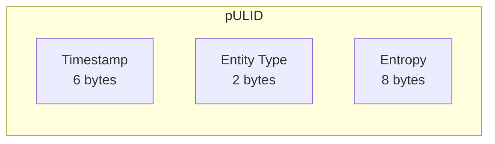

## pULID

- ULID compatible
- UUIDv4 compatible
- Time based
- with entropy abstraction optimized

## What different on ours? 
- WIP - Use of 7th and 8th byte to store entity type
- WIP - 2^{16} = 65536 entity types
- entropy used allows for concurrent calls
- uuid v4 compatible

## WIP - pULID Structure
```
  6bytes   2bytes    8bytes
| ------ | | -- | | -------- |
   epoch.  entity   entropy
```
### Structure:


### Supported Database Drivers
- pgx (coming soon)
- gorm (coming soon)
- sql.DB (coming soon)
             
### Benchmark
```
goos: darwin
goarch: arm64
pkg: github.com/pixie-sh/ulid-go
cpu: Apple M3 Max
BenchmarkNanoIDGeneration-16         	 4081274	       288.0 ns/op
BenchmarkAnotherULIDGeneration
BenchmarkAnotherULIDGeneration-16    	 9510402	       125.9 ns/op
BenchmarkpULIDGeneration
BenchmarkpULIDGeneration-16           	 8371111	       139.2 ns/op
BenchmarkUUIDGeneration 
BenchmarkUUIDGeneration-16           	 4945442	       246.9 ns/op
PASS
```

### Thank you
- github.com/google/uuid
- github.com/matoous/go-nanoid/v2
- github.com/oklog/ulid
- github.com/RobThree/NUlid
- github.com/segmentio/ksuid