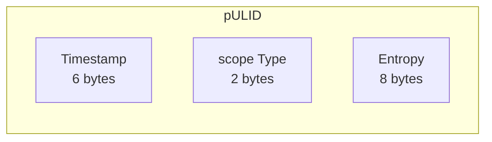

## pULID

- ULID compatible
- UUIDv4 compatible
- Time based
- with entropy abstraction optimized
- scope bytes can be used to store relevant information - such as entities types or namespaces
- scope 65535 and 0 are protected and used within th lib

## What different on ours? 
- Use of 7th and 8th byte to store scope type
- 2^{16} = 65536 - 2 = 65534 scope types available
- entropy used allows for concurrent calls
- uuid v4 compatible

## pULID Structure
```
  6bytes   2bytes    8bytes
| ------ | | -- | | -------- |
   epoch.  scope   entropy
```
### Structure:


### pULID strings example: 
```
for MaxScopeValue - 65535:

UUID: 0194AA0E-DCDE-FFFF-53F2-18257F60B037
ULID: 01JJN0XQ6YZZZN7WGR4NZP1C1Q
TS: 2025-01-27T23:18:08.350Z

UUID: 0194AA16-4A77-FFFF-4937-5547C5791AB7
ULID: 01JJN1CJKQZZZMJDTN8Z2QJ6NQ
TS: 2025-01-27T23:26:15.159Z
```
```
for Scope value 567

UUID: 0194AA15-34AB-0237-22E7-0B92B8C5F1B7
ULID: 01JJN1AD5B08VJ5SRBJAWCBWDQ
TS: 2025-01-27T23:25:04.043Z

UUID: 0194AA16-4A77-0237-42A9-56B6A8CBF3FF
ULID: 01JJN1CJKQ08VM5AAPPTMCQWZZ
TS: 2025-01-27T23:26:15.159Z
```

## Supported Database Drivers
- pgx (coming soon)
- gorm (coming soon)
- sql.DB (coming soon)
             
## Benchmark
```
goos: darwin
goarch: arm64
pkg: github.com/pixie-sh/ulid-go
cpu: Apple M3 Max
BenchmarkNanoIDGeneration-16         	 4081274	       288.0 ns/op
BenchmarkAnotherULIDGeneration
BenchmarkAnotherULIDGeneration-16    	 9510402	       125.9 ns/op
BenchmarkpULIDGeneration
BenchmarkpULIDGeneration-16           	 8371111	       139.2 ns/op
BenchmarkUUIDGeneration 
BenchmarkUUIDGeneration-16           	 4945442	       246.9 ns/op
PASS
```

### Thank you
- github.com/google/uuid
- github.com/matoous/go-nanoid/v2
- github.com/oklog/ulid
- github.com/RobThree/NUlid
- github.com/segmentio/ksuid